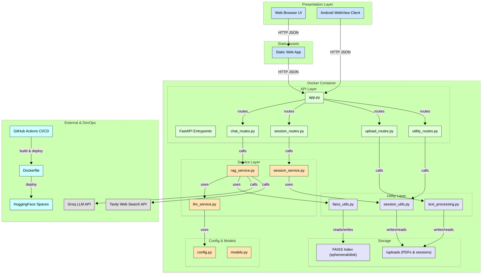

# PDF Insight Pro

An advanced PDF document analysis tool that combines RAG (Retrieval Augmented Generation) with agentic search capabilities to provide intelligent answers to queries about PDF documents.

## Table of Contents

- [Overview](#overview)
- [Features](#features)
- [RAG SYSTEM PERFORMANCE](#rag-system-metrics)
- [Architecture](#architecture)
- [Technical Stack](#technical-stack)
- [Installation](#installation)
- [Usage](#usage)
- [API Endpoints](#api-endpoints)
- [Deployment](#deployment)
- [Android App](#android-app)
- [License](#license)

## Overview

PDF Insight Pro is a sophisticated document analysis tool that allows users to upload PDF documents and ask questions about their content. The system uses state-of-the-art RAG techniques, combining document chunking, embedding generation, similarity search, and LLM processing to provide accurate and contextually relevant answers.

The application employs an agentic approach that can augment the document's information with web search capabilities when needed, ensuring comprehensive and up-to-date responses.

## Features

- **PDF Document Processing**: Upload and process PDF documents with automated text extraction and chunking
- **Agentic RAG System**: Combines document retrieval with powerful LLM reasoning
- **Web Search Integration**: Verifies document information with Tavily search API integration
- **Session Management**: Persistent session handling for chat history and document context
- **Multiple LLM Support**: Choose from different language models (Llama 4 Scout, Llama 3.1, Llama 3.3)
- **FastAPI Backend**: High-performance API with async support
- **Responsive UI**: User-friendly interface adaptable to different screen sizes
- **Docker Containerization**: Easy deployment with containerized application
- **Hugging Face Integration**: Automatic deployment to Hugging Face Spaces
- **Android Application**: Native mobile client


## RAG System Metrics

1. **Key Metrics Overview**:

| Metric                              | Value   |
| ----------------------------------- | ------- |
| **Semantic Similarity (Mean)**      | `0.852` |
| **ROUGE-L F1 Score (Mean)**         | `0.395` |
| **Semantic Similarity (Max)**       | `1.000` |
| **ROUGE-L F1 Score (Max)**          | `1.000` |
| **Semantic Similarity (Min)**       | `0.592` |
| **ROUGE-L F1 Score (Min)**          | `0.099` |
| **Standard Deviation (Similarity)** | `0.089` |
| **Standard Deviation (ROUGE-L F1)** | `0.217` |


2. **Quantile Distribution**:

| Percentile | Semantic Similarity | ROUGE-L F1 Score |
| ---------- | ------------------- | ---------------- |
| **25%**    | `0.7946`            | `0.2516`         |
| **50%**    | `0.8732`            | `0.3256`         |
| **75%**    | `0.9181`            | `0.4951`         |


3. **Evaluation Status**:

| Status | Count | Percentage |
| ------ | ----- | ---------- |
| PASS | `64`  | `85.3%`    |
| FAIL | `11`  | `14.7%`    |

## Architecture

The application follows a modular architecture with these main components:

### System Architecture Diagram



### Backend Components

1. **PDF Processing Module** (`preprocessing.py`):
   - Document loading and text extraction using PyMuPDF
   - Intelligent chunking with metadata preservation
   - Embedding generation with sentence transformers
   - FAISS vector index for similarity search

2. **RAG Engine**:
   - Context retrieval based on semantic similarity
   - LLM integration using Groq API
   - Agentic processing with tool-calling capabilities
   - Web search augmentation with Tavily API

3. **API Layer** (`app.py`):
   - FastAPI framework for REST endpoints
   - Session management and persistence
   - File upload and processing
   - Chat interface and history management

### Workflow

1. **Document Processing**:
   - User uploads a PDF document
   - System extracts text using PyMuPDF
   - Text is chunked into semantically meaningful segments
   - Embeddings are generated for each chunk
   - A FAISS index is built for efficient similarity search

2. **Query Processing**:
   - User submits a question about the document
   - System retrieves relevant chunks using semantic similarity
   - Relevant chunks are combined into a context window
   - Context and query are sent to the LLM for processing
   - Optional: Web search integration for fact verification

3. **Response Generation**:
   - LLM generates a response based on the provided context
   - If web search is enabled, additional information may be incorporated
   - Response is returned to the user
   - Chat history is updated and persisted

## Project Structure

The project is organized into a modular architecture with clear separation of concerns:

```
PDF-Insight-Beta/
├── app.py                      # Main FastAPI application entry point
├── gen_dataset.py             # Dataset generation and RAG evaluation scripts
├── test_RAG.ipynb            # Jupyter notebook for RAG system testing and metrics
├── requirements.txt           # Python dependencies
├── Dockerfile                 # Container configuration for deployment
├── LICENSE                    # MIT license file
├── README.md                 # Project documentation
├── README_hf.md              # Hugging Face Spaces specific documentation
├──
├── api/                       # API route handlers (modular FastAPI routes)
│   ├── __init__.py           # Exports all route handlers
│   ├── chat_routes.py        # Chat and conversation management endpoints
│   ├── session_routes.py     # Session lifecycle management
│   ├── upload_routes.py      # PDF upload and processing endpoints
│   └── utility_routes.py     # Utility endpoints (models, health checks)
├──
├── configs/                   # Configuration management
│   └── config.py             # Centralized configuration and environment variables
├──
├── models/                    # Pydantic data models
│   └── models.py             # Request/response models for API validation
├──
├── services/                  # Core business logic services
│   ├── __init__.py           # Service module initialization
│   ├── llm_service.py        # Language model integration and management
│   ├── rag_service.py        # RAG implementation with agentic capabilities
│   └── session_service.py    # Session persistence and management
├──
├── utils/                     # Utility functions and helpers
│   ├── __init__.py           # Utility module initialization
│   ├── faiss_utils.py        # FAISS vector database operations
│   ├── session_utils.py      # Session data serialization/deserialization
│   └── text_processing.py    # PDF text extraction and chunking utilities
├──
├── static/                    # Frontend web application
│   ├── index.html            # Main web interface
│   ├── css/
│   │   └── styles.css        # Application styling and responsive design
│   └── js/
│       └── app.js            # Frontend JavaScript for user interactions
├──
├── development_scripts/       # Legacy and development utilities
│   ├── app.py               # Original monolithic application (deprecated)
│   └── preprocessing.py      # Original preprocessing functions (deprecated)
├──
├── uploads/                   # Temporary storage for uploaded files and sessions
│   ├── *.pdf                # Uploaded PDF documents
│   └── *_session.pkl        # Serialized session data
├──
└── Android App/              # Native Android application
    ├── app/                  # Android app source code
    │   ├── src/main/java/com/jatinmehra/  # Java source files
    │   ├── src/main/res/     # Android resources (layouts, drawables, etc.)
    │   └── AndroidManifest.xml  # Android app configuration
    ├── gradle/               # Gradle build system files
    └── build.gradle          # Project build configuration
```

### Key Components Description

#### Core Application Files
- **`app.py`**: Main FastAPI application that orchestrates all components and sets up the web server
- **`gen_dataset.py`**: Comprehensive evaluation script for RAG system performance using the neural-bridge dataset
- **`test_RAG.ipynb`**: Interactive Jupyter notebook for testing RAG capabilities and analyzing metrics

#### API Layer (`api/`)
- **`chat_routes.py`**: Handles chat interactions, query processing, and conversation flow
- **`session_routes.py`**: Manages session lifecycle, history retrieval, and cleanup operations
- **`upload_routes.py`**: Processes PDF uploads, text extraction, and document indexing
- **`utility_routes.py`**: Provides system utilities like model listing and health checks

#### Configuration (`configs/`)
- **`config.py`**: Centralizes all application settings, API keys, model configurations, and environment variables

#### Data Models (`models/`)
- **`models.py`**: Defines Pydantic models for request/response validation and API documentation

#### Business Logic (`services/`)
- **`llm_service.py`**: Manages language model interactions, prompt engineering, and response generation
- **`rag_service.py`**: Implements the core RAG pipeline with agentic search capabilities and tool integration
- **`session_service.py`**: Handles session persistence, chat history, and user context management

#### Utilities (`utils/`)
- **`faiss_utils.py`**: Provides FAISS vector database operations for similarity search and indexing
- **`session_utils.py`**: Handles session serialization, deserialization, and data persistence
- **`text_processing.py`**: PDF text extraction, intelligent chunking, and preprocessing utilities

#### Frontend (`static/`)
- **`index.html`**: Responsive web interface with modern UI design
- **`styles.css`**: CSS styling with mobile-first responsive design principles
- **`app.js`**: JavaScript for dynamic interactions, file uploads, and chat functionality

#### Mobile Application (`Android App/`)
- **Native Android client**: WebView-based mobile application that interfaces with the web app
- **Java source code**: Activity management, splash screen, and WebView configuration
- **Android resources**: UI layouts, icons, and mobile-specific configurations

## Technical Stack

### Backend
- **Python 3.12**: Core programming language
- **FastAPI**: API framework with async support
- **PyMuPDF**: PDF processing library
- **LangChain**: Framework for LLM application development
- **FAISS**: Vector similarity search library from Facebook AI
- **Sentence Transformers**: Text embedding generation
- **Groq API**: LLM inference service
- **Tavily API**: Web search integration
- **Uvicorn**: ASGI server

### Frontend
- **HTML/CSS/JavaScript**: Core web technologies
- **Font Awesome**: Icon library
- **Highlight.js**: Code syntax highlighting
- **Marked.js**: Markdown rendering
- **Responsive Design**: Mobile-friendly interface

*Note: The frontend was developed with assistance from Claude 3.7 AI.*

### DevOps
- **Docker**: Containerization
- **GitHub Actions**: CI/CD pipeline
- **Hugging Face Spaces**: Deployment platform

## Installation

### Prerequisites
- Python 3.12+
- API keys for Groq and Tavily

### Local Setup

1. Clone the repository:
```bash
git clone https://github.com/Jatin-Mehra119/PDF-Insight-Beta.git
cd PDF-Insight-Beta
```

2. Create and activate a virtual environment:
```bash
python -m venv venv
source venv/bin/activate  # On Windows: venv\Scripts\activate
```

3. Install dependencies:
```bash
pip install -r requirements.txt
```

4. Create a `.env` file with your API keys:
```
GROQ_API_KEY=your_groq_api_key
TAVILY_API_KEY=your_tavily_api_key
```

5. Run the application:
```bash
uvicorn app:app --host 0.0.0.0 --port 8000 --reload
```

### Docker Deployment

1. Build the Docker image:
```bash
docker build -t pdf-insight-pro .
```

2. Run the container:
```bash
docker run -p 7860:7860 \
  --mount type=secret,id=GROQ_API_KEY,dst=/run/secrets/GROQ_API_KEY \
  --mount type=secret,id=TAVILY_API_KEY,dst=/run/secrets/TAVILY_API_KEY \
  pdf-insight-pro
```

## Usage

1. Open the application in your browser at `http://localhost:8000`
2. Upload a PDF document using the interface
3. Wait for processing to complete
4. Ask questions about the document in the chat interface
5. Toggle the "Use web search" option for enhanced responses

## API Endpoints

- **GET `/`**: Redirect to static HTML interface
- **POST `/upload-pdf`**: Upload and process a PDF document
  - Returns a session ID for subsequent queries
- **POST `/chat`**: Send a query about the uploaded document
  - Requires session ID from previous upload
  - Optional parameter to enable web search
- **POST `/chat-history`**: Retrieve chat history for a session
- **POST `/clear-history`**: Clear chat history for a session
- **POST `/remove-pdf`**: Remove PDF and session data
- **GET `/models`**: List available language models

## Deployment

### Hugging Face Spaces

This project is configured for automatic deployment to Hugging Face Spaces using GitHub Actions. The workflow in `.github/workflows/sync_to_hf.yml` handles the deployment process.

To deploy to your own space:

1. Fork this repository
2. Create a Hugging Face Space
3. Add your Hugging Face token as a GitHub secret named `HF_TOKEN`
4. Update the username and space name in the workflow file
5. Push to the main branch to trigger deployment

## Android App

The repository includes an Android application that serves as a mobile interface to the web application. Rather than implementing a native client with direct API integration, the Android app utilizes a WebView component to load the deployed web interface from Hugging Face Spaces. This approach ensures consistency between the web and mobile experiences while reducing maintenance overhead.

### Android App Features

- WebView integration to the deployed web application
- Splash screen with app branding
- Responsive design that adapts to the mobile interface
- Native Android navigation and user experience
- Direct access to the full functionality of the web application

### Implementation Details

The Android app is implemented using Java and consists of:
- SplashActivity: Displays the app logo and transitions to the main activity
- MainActivity: Contains a WebView component that loads the deployed web application
- WebView configuration: Enables JavaScript, DOM storage, and handles file uploads

## License

MIT 